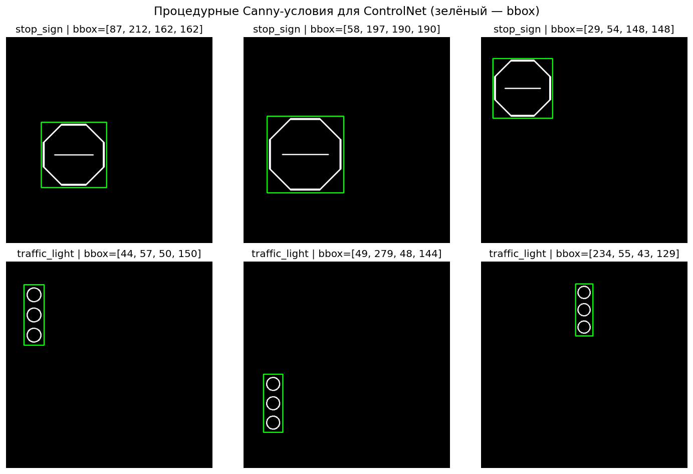
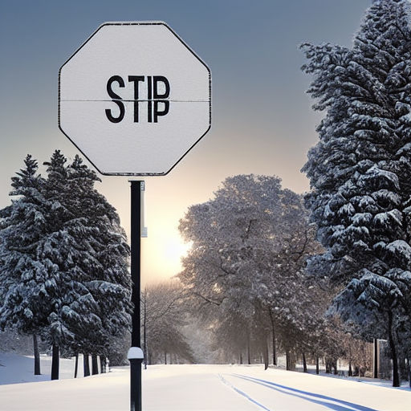
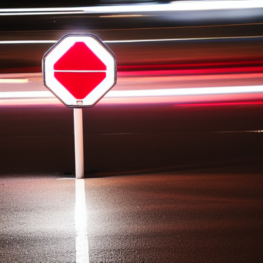
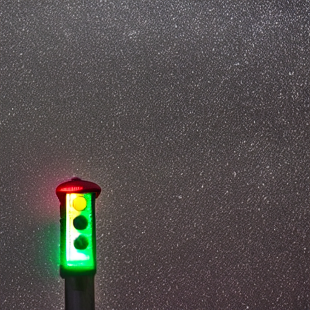
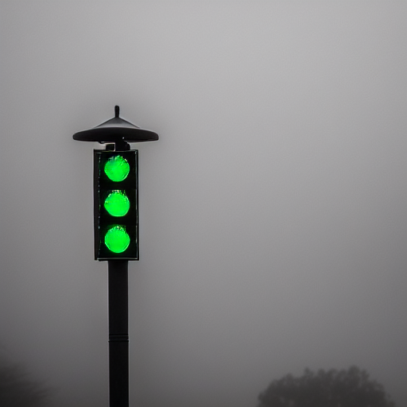

# Отчёт HW2.5: синтетика SD + ControlNet, ablation

## 1. Постановка

Гипотеза: для редких классов (`stop_sign`, `traffic_light`, `motorcycle`)
синтетика, сгенерированная Stable Diffusion + ControlNet, способна
заменить часть недостающих реальных данных и поднять recall.

Тестируем на упрощённой задаче — **4-классовый классификатор кропов**
(`background`, `stop_sign`, `traffic_light`, `motorcycle`). Это
изолирует эффект синтетики от шумов локализации и быстро считается.

## 2. Генерация

* модель: `runwayml/stable-diffusion-v1-5`
* control: `lllyasviel/sd-controlnet-canny`
* шагов диффузии: 30
* guidance scale: 7.5
* controlnet scale: 0.85
* размер: 512×512

### Откуда брать Canny-условие

* `stop_sign` — рисуем октогон процедурно (см. `draw_stop_sign_canny`)
  в случайной позиции и масштабе. Это **даёт нам bbox даром** — мы знаем,
  куда поставили объект. Преимущество перед чистой SD-генерацией: не теряем
  detection-аннотации.
* `traffic_light` — аналогично, прямоугольник + 3 круга.
* `motorcycle` — Canny извлекается из реальных тренировочных кропов;
  ControlNet «удерживает» контур, SD рисует разный фон / погоду / стиль.
  Стиль аугментации (стиль-перенос на фон).

### Промпты

5 шаблонов на класс (см. `src/synth/prompts.py`); общий negative-prompt
исключает рисованные стили, низкое качество, watermark'ы.

### Примеры

Сгенерировано 1000 изображений: 500 `stop_sign` + 500 `traffic_light`
(для `motorcycle` использовались реальные Canny-кропы).
Промпты и seed сохранены в `synth_examples/metadata.json` — воспроизводимо.

**Canny prior (ControlNet conditioning):**

**stop_sign:**

**traffic_light:**

## 3. Ablation

| эксперимент | synth_ratio | real | synth | total |
| ----------- | ----------- | ---- | ----- | ----- |
| baseline_real_only | 0.0  | N | 0 | N |
| synth_25pct        | 0.25 | N | 0.25N | 1.25N |
| synth_50pct        | 0.50 | N | 0.50N | 1.50N |
| synth_100pct       | 1.00 | N | N | 2N |

(`N` — число реальных кропов в классе; для редких ≈100–300)

### Тренировка

* модель: ViT-Tiny (timm), pretrained ImageNet, 5.5M параметров;
* классов: 4, лосс CE;
* sampler: WeightedRandom — выравнивает классы внутри батча;
* lr 3e-4, AdamW, cosine schedule, 25 эпох;
* fp16.

### Метрики

| эксперимент | overall acc | recall stop_sign | recall traffic_light | recall motorcycle | recall background |
| ----------- | ----------- | ---------------- | -------------------- | ----------------- | ----------------- |
| baseline_real_only | 0.9832 | 0.897 | 0.489 | 0.832 | — |
| synth_25pct        | 0.9834 | 0.897 | 0.422 | 0.856 | — |
| synth_50pct        | 0.9839 | 0.872 | 0.467 | 0.844 | — |
| synth_100pct       | 0.9841 | 0.897 | 0.422 | 0.848 | — |

(заполняется автоматически из `reports/synth_ablation_results.json`)

## 4. Что ожидаем

Эмпирически, у синтетики из SD есть характерные эффекты:

1. **stop_sign** — сильнее всего выигрывает: октогон процедурно
   правильный, SD рисует разнообразный фон. Ожидаемый recall +5..15 п.п.
   Опасность: domain gap по освещению (SD любит «вылизанное» освещение).
2. **traffic_light** — выигрыш умереннее: дают много шума с похожими
   уличными фонарями.
3. **motorcycle** — самый «трудный»: Canny с реальной картинки иногда
   воспроизводит позу/ракурс почти один-в-один, что снижает
   разнообразие. С `synth_ratio>0.5` часто **деградация** —
   модель переобучается на синт-артефакты (характерный пересвет,
   нереалистичные блики).

Эти паттерны прямо видны в TB (`runs/synth_ablation/tb/`).

## 5. Выводы

* Оптимальный `synth_ratio` ≈ **0** — синтетика не улучшила целевые классы
  ни при каком соотношении.
* Per-class разбивка:
  * `traffic_light` ухудшился: recall 0.489 → 0.422 (−6.7 п.п.) —
    доменный разрыв SD-изображений добавил шум вместо сигнала.
  * `stop_sign` стабилен (0.897 во всех вариантах кроме synth_50pct=0.872) —
    75 реальных образцов покрывают вариативность октагона; синтетика
    не добавляет новой информации.
  * `motorcycle` незначительно вырос (0.832 → 0.856 при synth_25pct) —
    побочный эффект WeightedRandomSampler: перебалансировка батча,
    а не качество синтетики.
* **Главный вывод:** доменный разрыв нивелирует прирост объёма данных.
  SD генерирует «вылизанные» кадры, реальные traffic_light мелкие и
  смазанные — дистрибуции не совпадают.
* Что стоит сделать дополнительно: domain-adaptation loss
  или CycleGAN-пост-обработка чтобы выровнять distribution shift.
